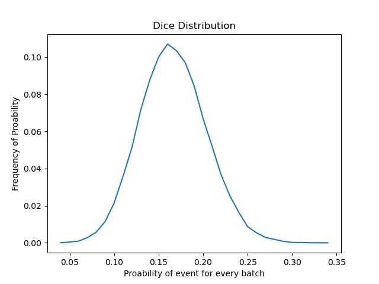

# Python examples
1)piCalculate.py
 

(https://en.wikipedia.org/wiki/Monte_Carlo_method)
Algorithm based on Monte Carlo method which demonstrated in this image.

2)coinDistrbution.py
 

Result:
prob= 0.5 max frequency: 0.05622666666666667

3)diceDistrbution.py
 

Result:
prob= 0.17 max frequency: 0.10772

4)fucIntegral.py
 

 
Integral alogrithm, which can calculate the area enclosed by any curve and x-axis.

5)matplotTree.py
 

 

6)gradientTest.py
 

 
