# Python examples
1)piCalculate.py
 
Monte Carlo method refer to:https://en.wikipedia.org/wiki/Monte_Carlo_method  
when N= 100 pi= 3.12  
when N= 10000 pi= 3.1484  
when N= 100000 pi= 3.1406  
when N= 10000000 pi= 3.1417028  
 
 
IntegralCalculatePi
 
 
S=(PixR^2)/4  => Pi=4xS/R^2 
when N= 100 s =  0.7901042579447618 pi =  3.160417031779047  
when N= 10000 s =  0.7854478694028293 pi =  3.141791477611317  
when N= 1000000 s =  0.7853986631034552 pi =  3.1415946524138207  

2)coinDistrbution.py
 
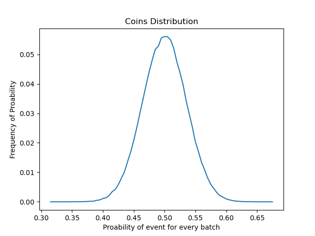

Result:
index= 33 prob= 0.5 max frequency: 0.056

3)diceDistrbution.py
 
 
index= 12 prob= 0.16 max frequency: 0.1071

4)fucIntegral.py
 

 
Integral alogrithm, which can calculate the area enclosed by any curve and x-axis.

5)gradientTest.py
 

 

6)plotFunction.py
 

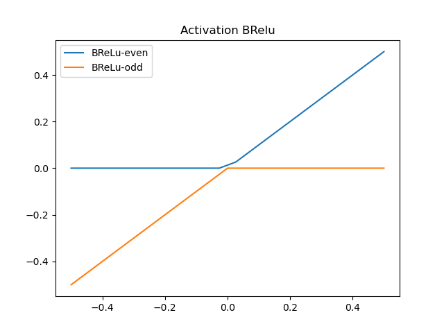

 

testLogisticMap(butterfly effect)
 

 

7)BenfordLaw.py
 

8)probDistribution.py
 

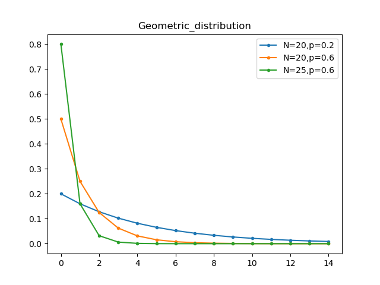

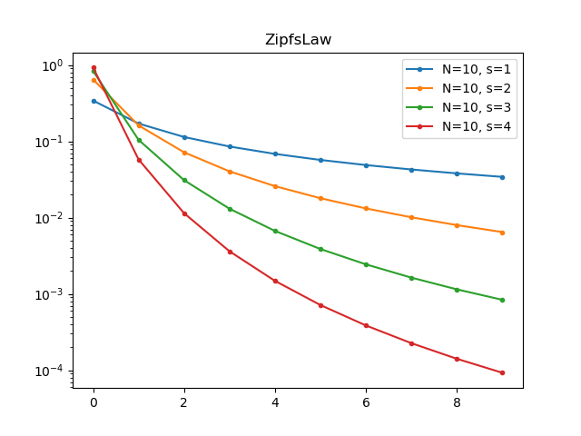

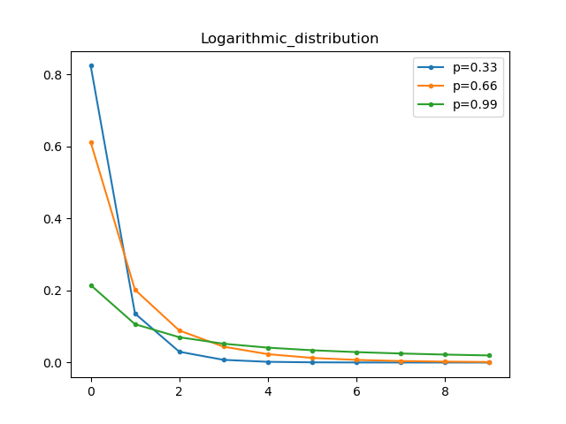
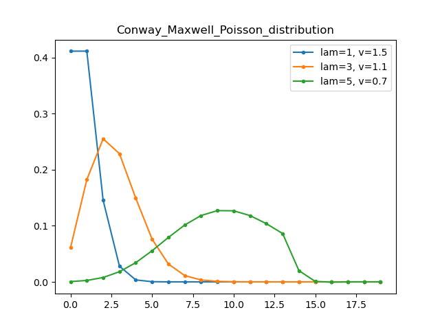

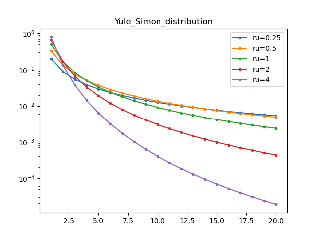
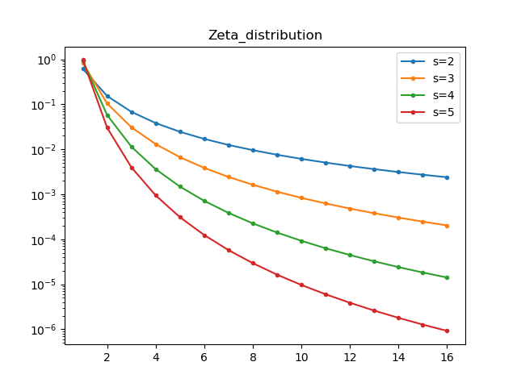
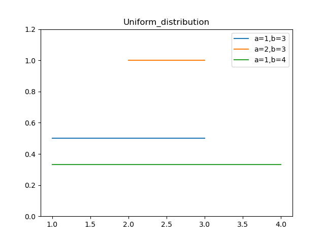

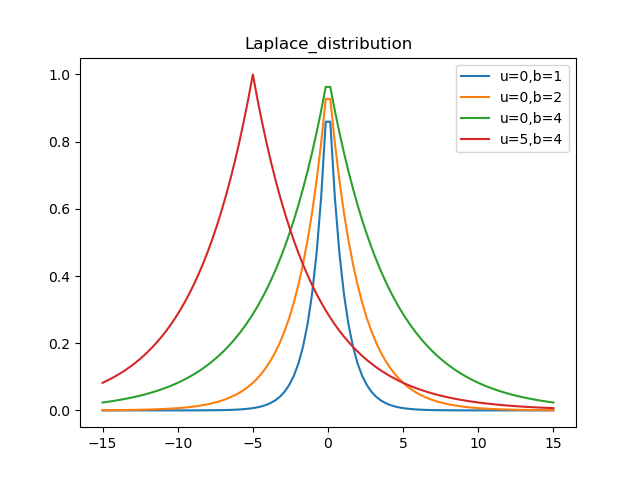
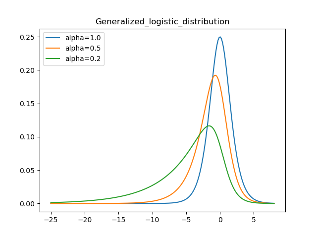

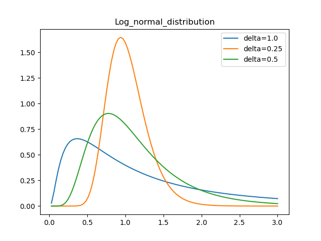
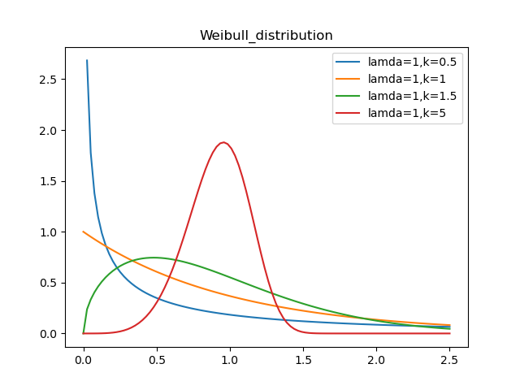
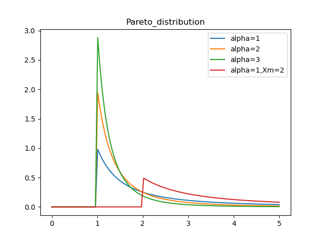
 

## ./Fractal/
1)matplotTree.py,matplotTree2.py
 

 

2)plotLogisticMap.py
 

 

3)plotLogisticMap2.py
 

 

4)plotMandelbrotSet.py
 

 

5)plotTriangle.py plotTriangle2,plotTriangle3
 
Sierpiński triangle,reference:https://en.wikipedia.org/wiki/Sierpi%C5%84ski_triangle
 

 
Random triangle and customized split ratio
 

 
6)plotTriangle4,plotTriangle5
 

