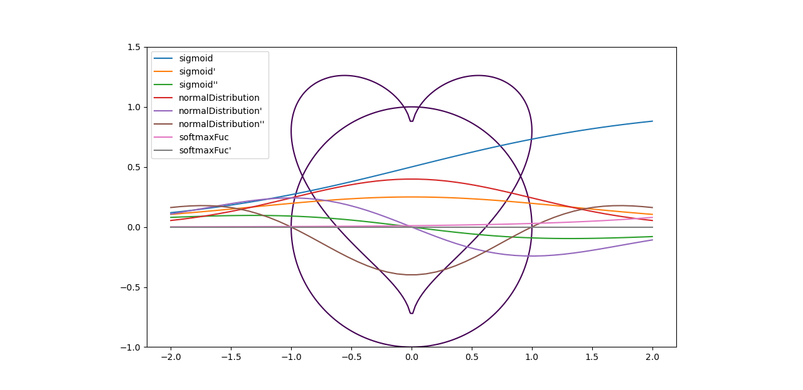
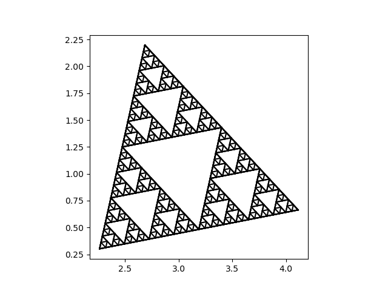

# Python examples
1)piCalculate.py
 
Monte Carlo method refer to:https://en.wikipedia.org/wiki/Monte_Carlo_method
 

 
IntegralCalculatePi
 

2)coinDistrbution.py
 

Result:
prob= 0.5 max frequency: 0.05622666666666667

3)diceDistrbution.py
 

Result:
prob= 0.17 max frequency: 0.10772

4)fucIntegral.py
 

 
Integral alogrithm, which can calculate the area enclosed by any curve and x-axis.

5)gradientTest.py
 

 

6)plotFunction.py
 

 

testLogisticMap(butterfly effect)
 

 

## ./Fractal/
1)matplotTree.py,matplotTree2.py
 

 

2)plotLogisticMap.py
 

 

3)plotLogisticMap2.py
 

 

4)plotMandelbrotSet.py
 

 

5)plotTriangle.py plotTriangle2,plotTriangle3
 
Sierpiński triangle,reference:https://en.wikipedia.org/wiki/Sierpi%C5%84ski_triangle
 

 
Random triangle and customized split ratio
 

 
6)plotTriangle4,plotTriangle5
 

